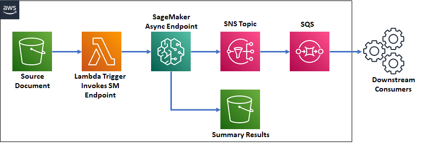

## Democratize Documentation Summarization in Media and Entertainment with Hugging Face Transformers on Amazon SageMaker

In this [example notebook](./deploy_hf_pipeline.ipynb), we'll go through an example of deploying a document summarization model from [HuggingFace Hub](https://huggingface.co/models). This model will take as input a long text document and will output a concise summary. We will deploy this model on an [asynchronous endpoint](https://docs.aws.amazon.com/sagemaker/latest/dg/async-inference.html) as most summarization use case do not require low latency making the asynchronous endpoint the ideal choice. 

Below is a sample architecture for an asynchronous document summarization service. As documents land in S3, a lambda function is triggered to invoke the SageMaker endpoint. Once the endpoint generates a summary of the document, it send the results to S3 and publishes an SNS notification not notify downstream consumers. The sample code provided here will only deploy the SageMaker endpoint, but can be easily extended to include the lambda trigger and SNS notifications.

We will rely on the library of pre-trained models available in the Hugging Face Model Hub. We will demonstrate how you can download a pre-trained model and deploy it on an asynchronous endpoint. Specifically, we'll cover:

* Downloading a pre-trained model from Hugging Face Model Hub
* Packaging the model with a customer inference script
* Deploying SageMaker inference resources to host the model on an asynchronous endpoint

## Security

See [CONTRIBUTING](CONTRIBUTING.md#security-issue-notifications) for more information.

## License

This library is licensed under the MIT-0 License. See the LICENSE file.